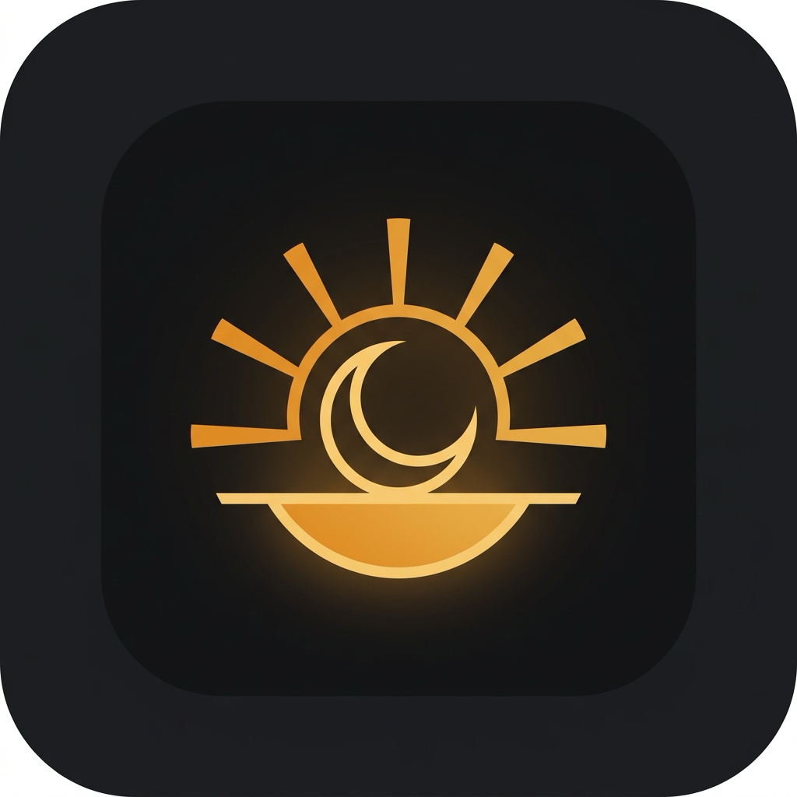

<p align="center">
  
</p>

<h1 align="center">Matuta</h1>

<p align="center">
  <b>macOS 알람 앱.</b> 원하는 음악으로 깨우고, 울리지 않을 이유를 미리 없앤다.
</p>

<p align="center">
  macOS 14.0 이상 · MIT 라이선스 · <a href="README.md">English</a>
</p>

> *마테르 마투타*(Mater Matuta)는 로마 신화의 새벽과 아침빛의 여신이다. 라틴어 *matutinus*(아침의)와 프랑스어 *matin*이 이 어근에서 나왔다.

---

## 왜 만들었나

macOS 기본 시계 앱의 알람에는 구멍이 세 개 있다.

- **절전에 들어가면 아예 안 울린다**
- 내장 벨소리 몇 개뿐, 내 음악을 못 넣는다
- 볼륨 페이드인·스누즈 길이·출력 기기 제어가 없다

그런데 기존 앱들은 대부분 **"일단 울리기만 하면 끝"을 가정**한다. 맥은 아이폰과 달리 출력이 블루투스 이어폰으로 가 있을 수도, 볼륨이 0일 수도, 음소거일 수도 있다.

Matuta의 차별점은 여기다 — **울리지 않을 경우를 미리 제거하는 것.**

## 하는 일

**절전에서 깨어난다.** 알람 2분 전에 전원 이벤트를 예약해 맥을 깨운다. 덮개를 닫아둬도 울린다.

**어떤 음악으로든 깨운다.** 입력 칸 하나에 링크를 붙여넣거나 파일을 끌어다 놓으면 앱이 알아서 판별한다 — 내장 벨소리, 로컬 음악 파일, 인터넷 라디오, Apple Music, Spotify, YouTube·웹.

**소리가 안 나는 상황을 미리 막는다.** 알람 시각에 출력을 내장 스피커로 되돌리고, 음소거를 풀고, 볼륨을 확보한다. 외부 앱이나 웹으로 재생하는 소스는 검증할 수 없으므로 **백업음을 함께 깐다.** 무슨 일이 있어도 소리는 난다.

**자기 전에 문제를 알려준다.** 나이트스탠드 모드 하단에 현재 상태가 뜬다. 이어폰이 꽂혀 있거나, 음소거이거나, 볼륨이 낮으면 주황색 경고와 함께 **한 번 눌러 고칠 수 있는 버튼**이 붙는다. 정상일 때는 조용하다.

**스페이스바 한 번으로 끈다.** 스누즈는 일부러 마우스로만 누르게 했다. 끄기는 쉽게, 다시 자기는 어렵게.

**한국어와 영어를 지원한다.** 기본은 시스템 언어를 따르고, 설정(⌘,)에서 바꾸면 재시작 없이 앱 전체가 즉시 바뀐다.

## 설치

[릴리스 페이지](../../releases)에서 최신 `Matuta-1.0.0.zip`을 받아 압축을 풀고 `Matuta.app`을 응용 프로그램 폴더로 옮긴다.

Developer ID로 서명하고 Apple 공증을 받았으므로 경고 없이 열린다.

### 처음 실행할 때

Spotify나 Apple Music을 알람 소스로 쓰면 **"Matuta가 Spotify를 제어하도록 허용하시겠습니까?"** 대화상자가 뜬다. 허용해야 그 음악이 재생된다. 거부해도 백업음은 울리므로 늦잠을 자지는 않는다.

나중에 바꾸려면 시스템 설정 → 개인정보 보호 및 보안 → 자동화에서 조정한다.

## 소스에서 빌드

```bash
git clone <저장소 주소>
cd matuta
swift test          # 단위 테스트
./Scripts/bundle.sh # build/Matuta.app 생성 (임시 서명)
open build/Matuta.app
```

Xcode 프로젝트 파일이 없다. 순수 SwiftPM이라 전 과정이 터미널에서 재현된다.

배포판을 만들려면 Developer ID 인증서와 공증 자격증명이 필요하다.

```bash
xcrun notarytool store-credentials matuta --apple-id <애플ID> --team-id <팀ID>
./Scripts/release.sh   # 빌드 → 서명 → 공증 → 스테이플 → 검증
```

## 구조

순수 로직은 전부 `MatutaCore`에 있고 단위 테스트가 지킨다. 앱 레이어는 시스템 I/O와 화면만 담당한다.

```
MatutaCore/            판정과 계산 (테스트 대상)
├── NextOccurrence     다음 발생 시각
├── Scheduler          다음 알람 선택 + 스누즈 반영
├── AlarmStore         JSON 영속화
├── PlaybackChain      소스 폴백 · 백업음 동시 재생
├── PreflightEvaluator 사전 진단 판정
├── OmniboxParser      입력 → 소스 판별
├── Localizer          한국어·영어 문자열 카탈로그
└── TonePattern        알람음 파형 합성

Matuta/                시스템 I/O와 화면
├── AudioGuard         출력 기기 · 볼륨 · 음소거
├── SystemWakeScheduler 전원 이벤트 예약
├── AutomationPermission 외부 앱 제어 권한
└── Views/             SwiftUI 화면
```

알람음은 오디오 파일이 아니라 **코드로 합성한다.** 파일이 없으니 파일이 사라져서 못 울릴 일도 없다.

## 문서

| 문서 | 내용 |
|---|---|
| [설계](docs/superpowers/specs/2026-09-02-macos-alarm-app-design.md) | 시장 조사, 포지셔닝, UI, 아키텍처, 범위 |
| [코드 진단과 개선 기획](docs/superpowers/specs/2026-09-02-code-review-and-cleanup-plan.md) | 초기 구현의 문제와 개선 순서 |
| [배포 전 검토](docs/superpowers/specs/2026-09-03-release-readiness-1.0.0.md) | 1.0.0 릴리스 점검 |
| [현지화 설계](docs/superpowers/specs/2026-09-04-localization-design.md) | 한국어·영어 인앱 전환 |

## 하지 않기로 한 것

미션형 해제(수학 문제·사진 촬영), 범용 아침 자동화 런처, iOS 앱과 동기화, 테마 추가 확장(현재 6종에서 동결).

## 라이선스

MIT. 자세한 내용은 [LICENSE](LICENSE) 참고.
