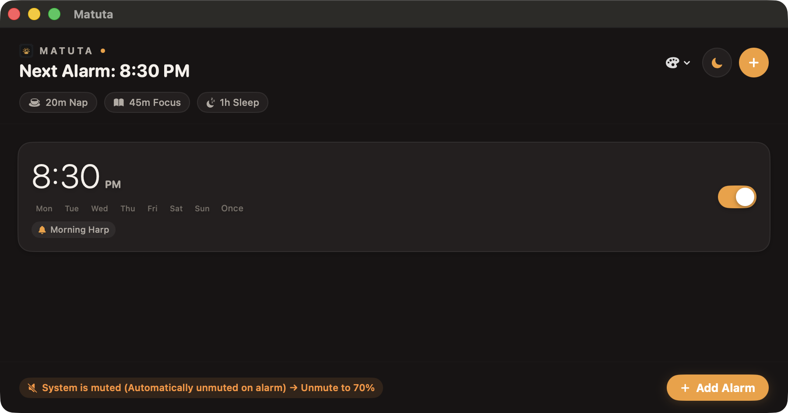
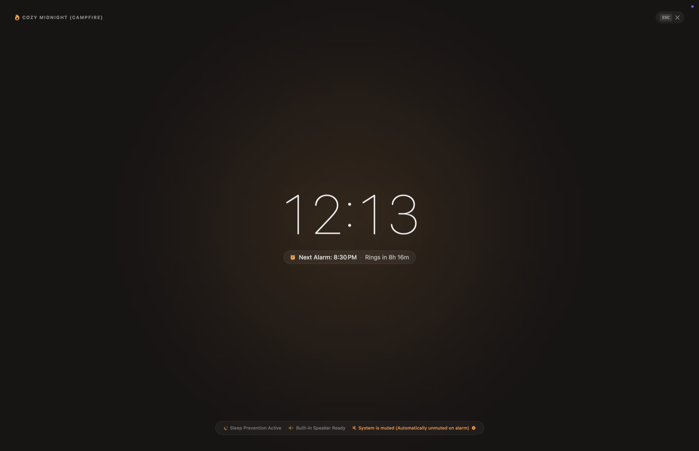
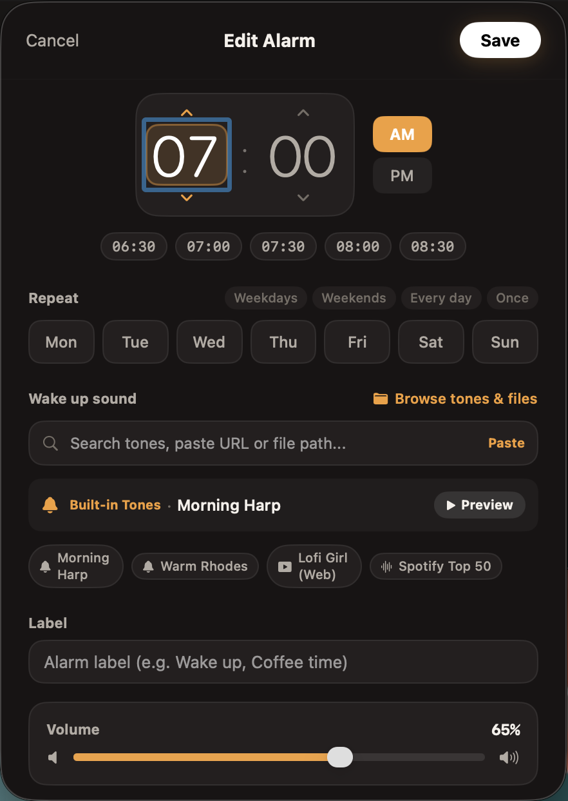
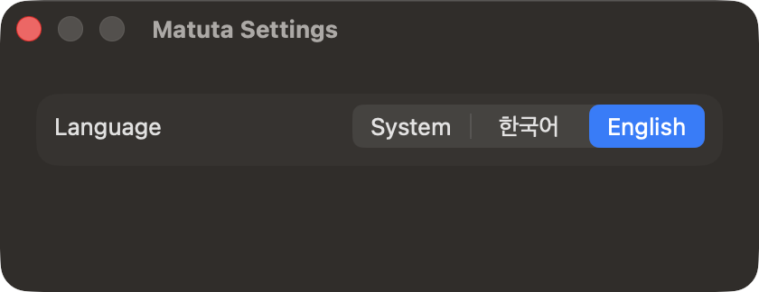

<p align="center">
  
</p>

<h1 align="center">Matuta</h1>

<p align="center">
  <b>A macOS alarm clock.</b> Wake up to any music you want — and stop worrying that it won't go off.
</p>

<p align="center">
  <a href="https://rakkunn.github.io/matuta/"><b>Website</b></a> · macOS 14.0+ · MIT License · <a href="README.ko.md">한국어</a>
</p>

> *Mater Matuta* was the Roman goddess of the dawn and the morning light. The Latin *matutinus* ("of the morning") and the French *matin* both come from her name.

---

<p align="center">
  
</p>

## Why

The alarm in the built-in macOS Clock app has three holes in it.

- **It doesn't ring once your Mac goes to sleep.**
- You get a handful of built-in tones. You can't use your own music.
- No fade-in, no snooze length, no control over which speaker it comes out of.

And most alarm apps assume that ringing is the whole job. But a Mac isn't a phone. Your output might be routed to Bluetooth earbuds, the volume might be at zero, the system might be muted — and you'd never know until you slept through your morning.

That's the gap Matuta fills: **removing the reasons an alarm fails to wake you.**

## What it does

**It wakes your Mac from sleep.** Matuta schedules a power event two minutes before each alarm. Close the lid and it still rings.

**Any music source.** One field. Paste a link, drop a file, or type a song name — Matuta figures out what you gave it: built-in tones, local audio files, internet radio, Apple Music, Spotify, YouTube and the web.

**It clears the path before the alarm fires.** At alarm time it routes audio back to the built-in speakers, unmutes the system, and raises the volume. For sources it can't verify — an external app, a browser tab — it plays a **backup tone underneath.** Something always makes noise.

**It tells you what's wrong before you fall asleep.** The nightstand view shows your current state along the bottom. Earbuds plugged in, system muted, volume too low — each one turns amber with a **one-click fix.** When everything is fine, it stays quiet.

**Spacebar to dismiss.** Snooze is deliberately mouse-only. Easy to turn off, harder to fall back asleep.

**Korean and English.** Follows your system language by default; switch it in Settings (⌘,) and the whole app changes immediately — no restart.

## Screenshots

<p align="center">
  
</p>
<p align="center"><sub><i>Nightstand mode. The row along the bottom names anything that would keep the alarm from waking you — and each warning fixes itself in one click.</i></sub></p>

<p align="center">
  
</p>
<p align="center"><sub><i>One field takes a link, a dropped file, or a search. Matuta works out which kind of source it is.</i></sub></p>

<p align="center">
  
</p>
<p align="center"><sub><i>Language switches without a restart.</i></sub></p>

## Install

Download the latest `Matuta-*.zip` from the [releases page](../../releases), unzip it, and drag `Matuta.app` into your Applications folder.

The app is signed with a Developer ID and notarized by Apple, so it opens without warnings.

### First launch

If you pick Spotify or Apple Music as an alarm source, macOS will ask whether Matuta may control that app. You need to allow it for your music to play. If you decline, the backup tone still rings — you won't oversleep.

To change your mind later: System Settings → Privacy & Security → Automation.

## Build from source

```bash
git clone https://github.com/RAKKUNN/matuta.git
cd matuta
swift test           # unit tests
./Scripts/bundle.sh  # builds build/Matuta.app (ad-hoc signed)
open build/Matuta.app
```

There's no Xcode project file. It's plain SwiftPM, so the whole process is reproducible from a terminal.

Building a distributable release needs a Developer ID certificate and notarization credentials:

```bash
xcrun notarytool store-credentials matuta --apple-id <apple-id> --team-id <team-id>
./Scripts/release.sh   # build → sign → notarize → staple → verify
```

## How it's put together

All decision-making and calculation lives in `MatutaCore` and is covered by unit tests. The app layer only handles system I/O and drawing.

```
MatutaCore/            decisions and calculation (tested)
├── NextOccurrence     when an alarm fires next
├── Scheduler          picks the next alarm, accounts for snooze
├── AlarmStore         JSON persistence
├── PlaybackChain      source fallback, concurrent backup tone
├── PreflightEvaluator pre-sleep diagnosis
├── OmniboxParser      input → source type
├── Localizer          Korean/English string catalog
└── TonePattern        alarm tone synthesis

Matuta/                system I/O and UI
├── AudioGuard         output device, volume, mute
├── SystemWakeScheduler power event scheduling
├── AutomationPermission external app control permission
└── Views/             SwiftUI screens
```

Two decisions worth calling out.

**Alarm tones are synthesized in code, not shipped as audio files.** There's no file to go missing, so there's no way for the alarm to fail because an asset didn't load.

**The core never produces sentences.** It emits keys, and the view resolves them against the current language. That's what makes switching languages instant, and it means the core's tests assert on keys rather than on Korean prose — so rewording a message doesn't break them.

## Docs

Design notes are in Korean.

| Document | Contents |
|---|---|
| [Design](docs/superpowers/specs/2026-09-02-macos-alarm-app-design.md) | Market research, positioning, UI, architecture, scope |
| [Code review & cleanup plan](docs/superpowers/specs/2026-09-02-code-review-and-cleanup-plan.md) | Problems in the first implementation and the order they were fixed |
| [Release readiness](docs/superpowers/specs/2026-09-03-release-readiness-1.0.0.md) | 1.0.0 shipping checklist |
| [Localization design](docs/superpowers/specs/2026-09-04-localization-design.md) | Korean/English in-app switching |

## Deliberately not doing

Dismissal missions (math problems, photo tasks), a general-purpose morning automation runner, an iOS app or sync, and additional themes beyond the current six.

## License

MIT. See [LICENSE](LICENSE).
